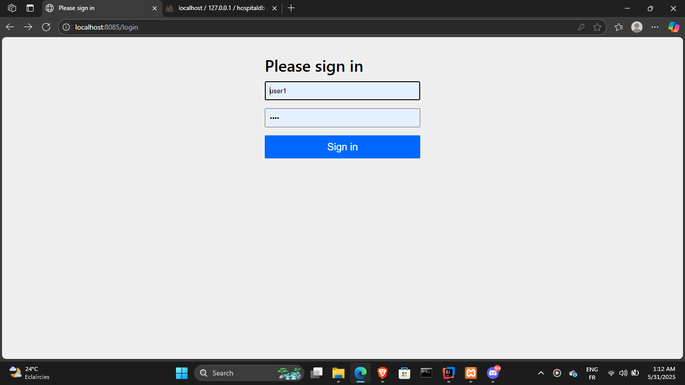
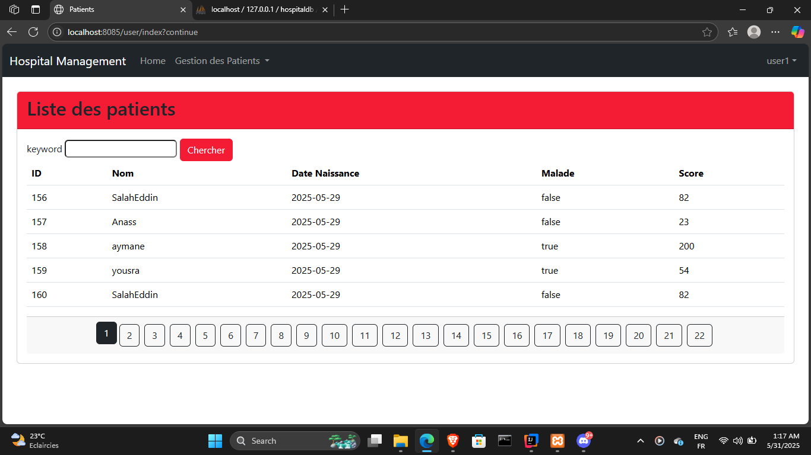
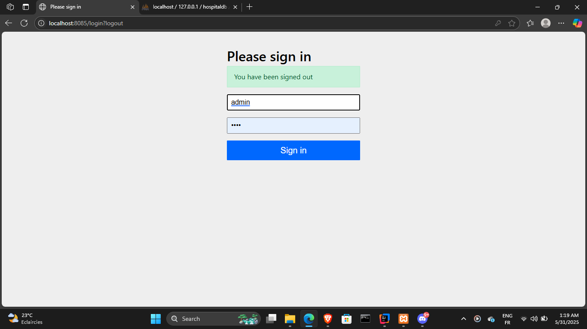
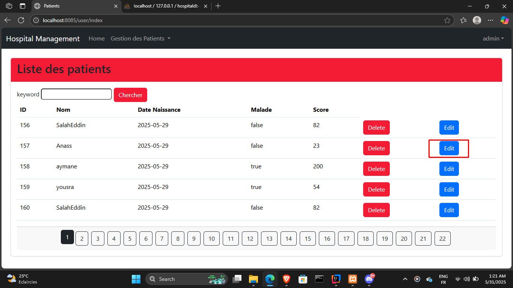
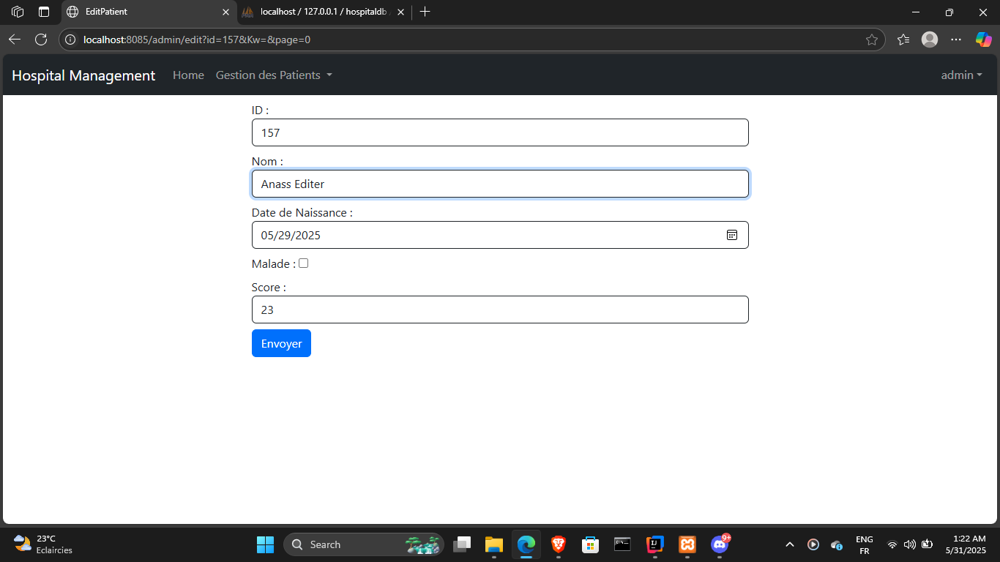
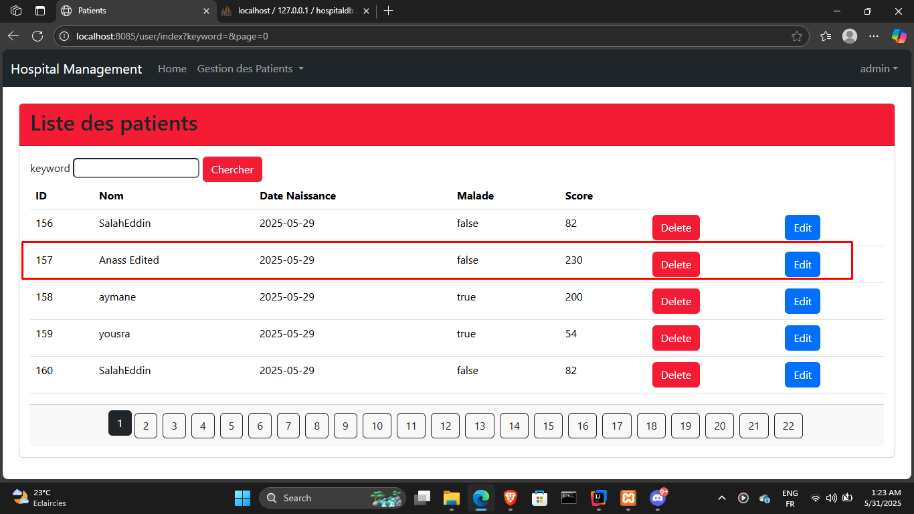
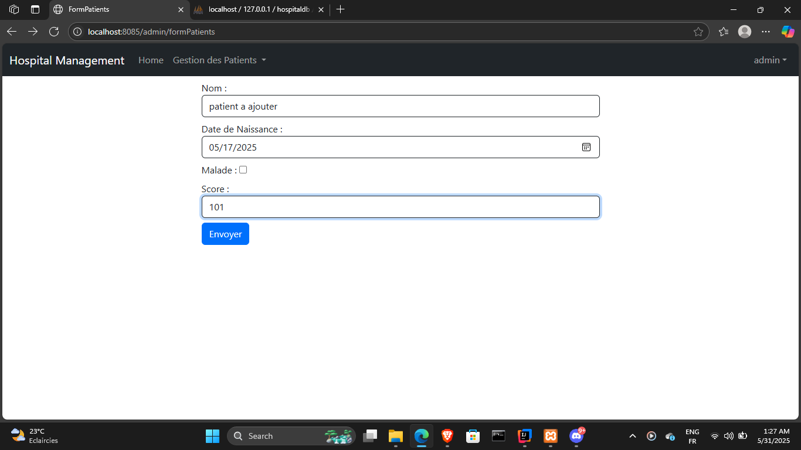
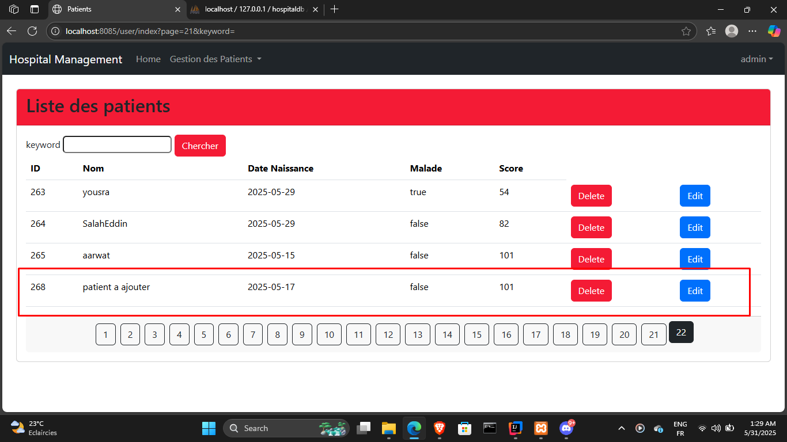
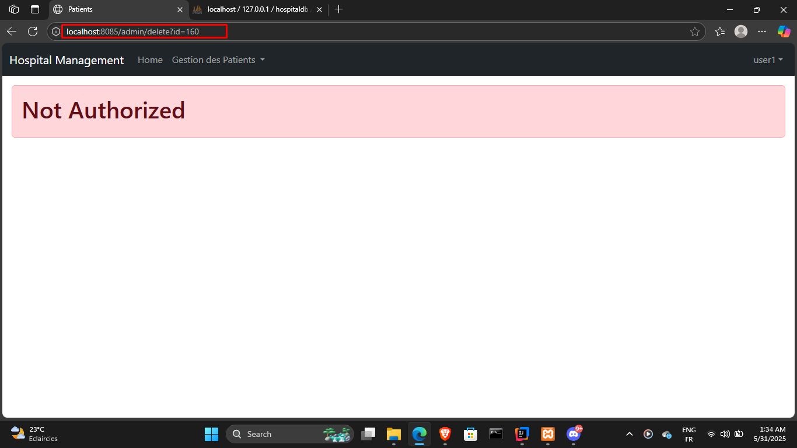

## 🏥 Rapport du TP N°3 : Hospital Management avec Spring MVC

### 🔖 1. Présentation Générale

Le projet **Hospital Management** est une application web développée avec **Spring Boot**, conçue pour gérer les informations des patients dans un établissement hospitalier. Il permet aux utilisateurs d’ajouter, de modifier, de supprimer et de consulter les patients, tout en appliquant des règles d’accès selon les rôles (USER/ADMIN).

---

### 🗂️ 2. Structure du Projet

```
src/
└── main/
    ├── java/
    │   └── com/example/hospital_management/
    │       ├── HospitalManagementApplication.java
    │       ├── entites/
    │       │   └── Patient.java
    │       ├── repositories/
    │       │   └── PatientRepository.java
    │       ├── security/
    │       │   └── SecurityConfig.java
    │       └── web/
    │           ├── PatientController.java
    │           └── SecurityController.java
    └── resources/
        ├── application.properties
        ├── static/
        └── templates/
            ├── editPatient.html
            ├── formPatients.html
            ├── navBar.html
            ├── notAuthorized.html
            └── patients.html
```

---

### 🧩 3. Description des Composants

#### 🔹 `HospitalManagementApplication.java`

Point d’entrée principal de l’application Spring Boot.
````java
@SpringBootApplication
public class HospitalManagementApplication {
    @Autowired
    private PatientRepository patientRepository;
    public static void main(String[] args) {
        SpringApplication.run(HospitalManagementApplication.class, args);
    }
//    @Bean
    CommandLineRunner start(PatientRepository patientRepository) {
        return args -> {
            Patient p1 = Patient.builder()
                    .nom("Anass")
                    .dateNaissance(new Date())
                    .score(23)
                    .malade(false)
                    .build();
            patientRepository.save(p1);
            patientRepository.save(new Patient(null,"aymane",new Date(),true,200));
            patientRepository.save(new Patient(null,"yousra",new Date(),true,54));
            patientRepository.save(new Patient(null,"SalahEddin",new Date(),false,82));
        };}
    @Bean
    public PasswordEncoder passwordEncoder() {
        return new org.springframework.security.crypto.bcrypt.BCryptPasswordEncoder();
    }
}
````

#### 🔹 `entites/Patient.java`

Classe d’entité représentant un patient. Elle contient les attributs de base (id, nom, date de naissance, etc.) et est annotée avec `@Entity`.

````java
@Entity @Data
@NoArgsConstructor @AllArgsConstructor
@Builder
public class Patient {
    @Id @GeneratedValue(strategy = GenerationType.IDENTITY)
    private Long id;
    @NotEmpty
    @Size(min = 5, max = 20)
    private String nom;
    @Temporal(TemporalType.DATE)
    @DateTimeFormat(pattern = "yyyy-MM-dd")
    private Date dateNaissance;
    private boolean malade;
    @DecimalMin("100")
    private int score;
}

````

#### 🔹 `repositories/PatientRepository.java`

Interface qui hérite de `JpaRepository`, permettant de faire des opérations CRUD sur les patients.
````java
public interface PatientRepository extends JpaRepository<Patient, Long> {
    Page<Patient> findByNomContains(String keyword, Pageable pageable);
}
````

#### 🔹 `security/SecurityConfig.java`

Classe de configuration Spring Security :

* Définit un `InMemoryUserDetailsManager` avec des rôles USER/ADMIN.
* Protège les routes selon les rôles.
* Définit une page d’accès refusé personnalisée (`notAuthorized.html`).
````java
@Configuration
@EnableWebSecurity
public class SecurityConfig {
    @Bean
    public InMemoryUserDetailsManager inMemoryUserDetailsManager(PasswordEncoder passwordEncoder){
        String encodedPassword = passwordEncoder.encode("1234");
        System.out.println(encodedPassword);
        return new InMemoryUserDetailsManager(
                User.withUsername("user1").password(encodedPassword).roles("USER").build(),
                User.withUsername("user2").password(encodedPassword).roles("USER").build(),
                User.withUsername("admin").password(encodedPassword).roles("USER","ADMIN").build()
        );}
    @Bean
    public SecurityFilterChain securityFilterChain(HttpSecurity httpSecurity) throws Exception {
        return httpSecurity
                .formLogin(Customizer.withDefaults())
                .authorizeHttpRequests(ar->
                        ar.requestMatchers("/delete/**").hasRole("ADMIN"))
                .authorizeHttpRequests(ar->
                        ar.requestMatchers("/admin/**").hasRole("ADMIN"))
                .authorizeHttpRequests(ar->
                        ar.requestMatchers("/user/**").hasRole("USER"))
                .authorizeHttpRequests(ar->
                        ar.anyRequest().authenticated())
                .exceptionHandling(eh->
                        eh.accessDeniedPage("/notAuthorized"))
                .build();}}
````

#### 🔹 `web/PatientController.java`

Contrôleur gérant les routes liées aux patients :
````java
@Controller
@AllArgsConstructor
public class PatientController {
    private PatientRepository patientRepository;
}
````

* Page d'acceuil pour afficher la liste des patients avec la pagination :
````java
   @GetMapping("/user/index")
    public String index(Model model, @RequestParam(name = "page",defaultValue = "0") int page,
                        @RequestParam(name = "size",defaultValue = "5")int size,
                        @RequestParam(name = "keyword",defaultValue = "") String k) {
        Page<Patient> patientsPage = patientRepository.findByNomContains(k,PageRequest.of(page, size));
        model.addAttribute("patientsList", patientsPage.getContent());
        model.addAttribute("pages", new int[patientsPage.getTotalPages()]);
        model.addAttribute("currentPage",page);
        model.addAttribute("keyword",k);
        return "patients";
    }
````
* Méthode de controlleur pour supprimer des patient (réservé au rôle ADMIN):
````java
    @GetMapping("/admin/delete")
    public String delete(Long id,String Kw, int page){
        patientRepository.deleteById(id);
        return "redirect:/user/index?keyword="+Kw+"&page="+page;
    }
```` 
* Méthode de controlleur pour `Ajouter` des patient (réservé au rôle ADMIN):

````java
    @GetMapping("/admin/formPatients")
    public String formPatients(Model model){
        model.addAttribute("patient",new Patient());
        return "formPatients";
    }
    @PostMapping("/admin/save")
    public String save(Model model , @Valid Patient patient, BindingResult bindingResult, String Kw, int page){
        if(bindingResult.hasErrors()) return "formPatients";
        patientRepository.save(patient);
        return "redirect:/user/index?keyword="+Kw+"&page="+page;
    }
````
* Méthode de controlleur pour `Modifier` des patient (réservé au rôle ADMIN):

````java
    @GetMapping("/admin/edit")
public  String edit(Model model,Long id, String Kw, int page){
    Patient patient = patientRepository.findById(id).orElse(null);
    if(patient==null) throw new RuntimeException("Patient not found");
    model.addAttribute("patient",patient);
    model.addAttribute("keyword",Kw);
    model.addAttribute("page",page);
    return "editPatient";
}
````

#### 🔹 `web/SecurityController.java`

Contrôleur pour gérer les vues de sécurité comme l'accès refusé.
````java
    @GetMapping("/notAuthorized")
    public String notAuthorized(){
        return "notAuthorized";
    }
````

---

### 🖼️ 4. Interface Utilisateur 
* #### **Tant que `user` :**
* `login.html` : Formulaire pour s'authentifier autant que User/Admin.

* `user/index.html` : Interface pour chercher des patient :
  
* #### **Tant que `admin` :**
* `login.html` : Formulaire pour s'authentifier autant que User/Admin.
    
* `user/index.html` : Interface pour chercher/ supprimer/ modifier des patients :
  
* `admin/editPatient.html` : Édition d’un patient existant.








* `admin/formPatients.html` : Formulaire d’ajout ou de mise à jour d’un patient.
  
  

  

* `notAuthorized.html` : Page affichée lorsqu’un utilisateur tente d’accéder à une page interdite.

  

---

### ⚙️ 5. Fichier de Configuration

#### `application.properties` :

Contient les configurations essentielles, par exemple :

```properties
spring.application.name=Hospital_management
server.port=8085
spring.datasource.url=jdbc:mysql://localhost:3306/hospitalDB?createDatabaseIfNotExist=true
spring.datasource.username=root
spring.datasource.password=
spring.jpa.hibernate.ddl-auto=update
spring.jpa.properties.hibernate.dialect=org.hibernate.dialect.MariaDBDialect
spring.mvc.format.date=yyyy-MM-dd
```

---

### 🔐 6. Sécurité

* Utilisation de Spring Security avec authentification in-memory.
* Rôles :

    * `USER` : accès en lecture.
    * `ADMIN` : accès en écriture et suppression.
* Routes sécurisées avec `.requestMatchers(...)`.
* Redirection vers `/notAuthorized` si accès refusé.

---

### 7. Dépendances Utilisées
1. JPA 
2. H2 
3. Spring Web 
4. Lombock
5. thymeleaf
6. springsecurity6
7. mysql-connector-j	
8. devtools
9. thymeleaf-layout-dialect	
10. webjars:bootstrap	